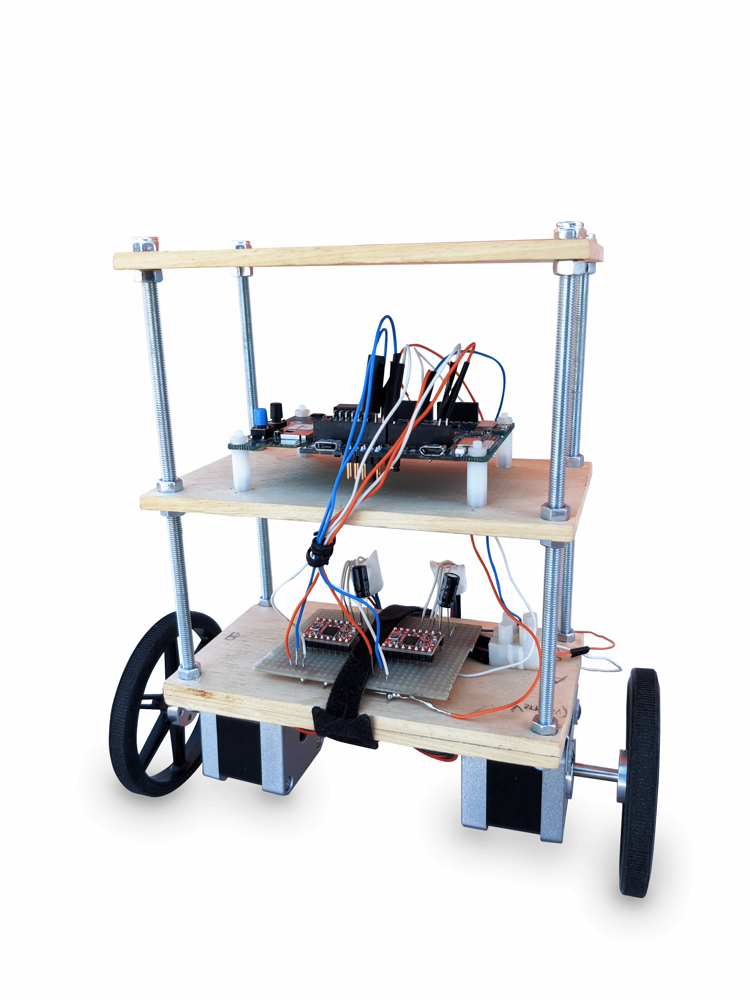

# Self-Balancing Robot 

University Project.

Self-Balancing Robot using STM32 board and FreeRTOS.

## Hardware
- STM32L4 (B-L475-IOT1A)
- 2x NEMA-17 Stepper Motor
- 2x A4988 Stepper Motor Driver
- 2x Wheel 80mm x 10mm
- 9V Battery
- 9V Battery Connector
- 2x 100uF Capacitor
- Wires
- 3x Wood 150mm x 85mm x 5mm
- 4x Rod 200mm M5
- 8x Dome Nut M5
- 16x Nut M5

## Features
- Use FreeRTOS (realtime operating system)
- Use FreeRTOS tasks for assign different priorities to different functionalities
- Complementary Filter - for estimate the angle accurately
- PID controller - for compute the motor output
- Gyroscope Autotuning - for minimize gyroscope measurement errors
- All the parameters (PID, filter, setpoint, gyroscope offset, ...) are configurable at runtime through the serial
- Start/Stop either via serial or with the STM32 blue button
- STM32 leds blink according to the direction and the speed of the motors
- Implement a circular output buffer for being able to print to serial asynchronously (at a low priority)